= Project Manager Manual for Dialogflow
:toc: auto
:T: <<toc,Back to top>>

== Getting Started

Go to https://dialogflow.cloud.google.com/[Google DialogFlow] and log in with your Google account.

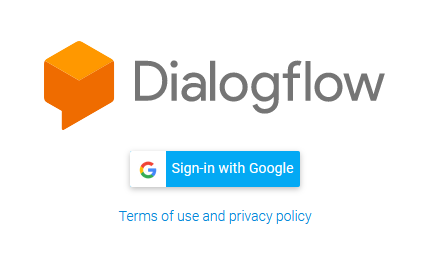

=== Creating New Project

For a fresh account, you may create a chatbot after agreeing to the *Terms of Service*

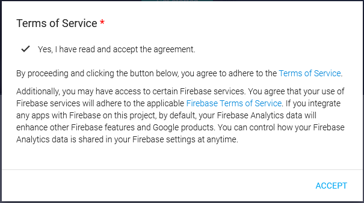

*Create an Agent* from the left sidebar

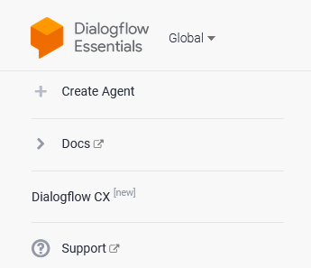

Give it a name and set the *Language* and *Timezone*

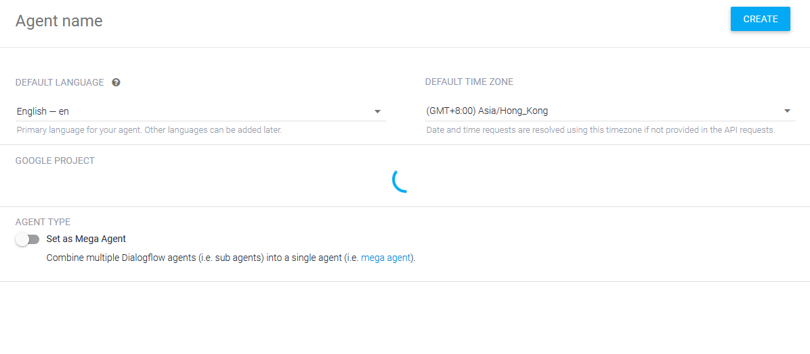

Your agent must be linked to a google project. Select the project you want to use or *Create a New Project*.

=== Editing Existing Project

For an account with existing bots, you can click on the *Dropdown* menu to select it.

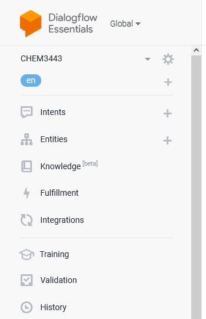

{T}

== Granting Team Access

To allow your team members to access the project, head to the *Settings(Cog Wheel) > Share*

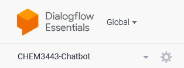 

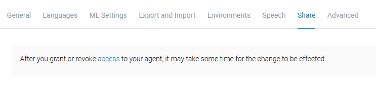 

You may add (or remove) the email of your team members, either as a *Reviewer* or *Developer*

{T}

== Enabling Fullfillment

Enabling fullfillment is important as it is the core part of the logic processing for the chatbot. The fulfillment tab is on the left sidebar

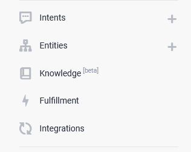 

There are 2 ways of using fulfillment

=== 1. Using Webhook

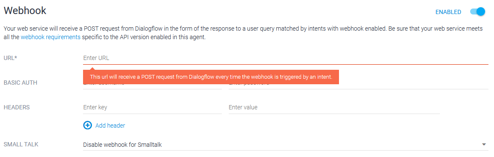

This requires having a server accessible by the chatbot, where the server will do most of the logic processing.

=== 2. Using Google Cloud

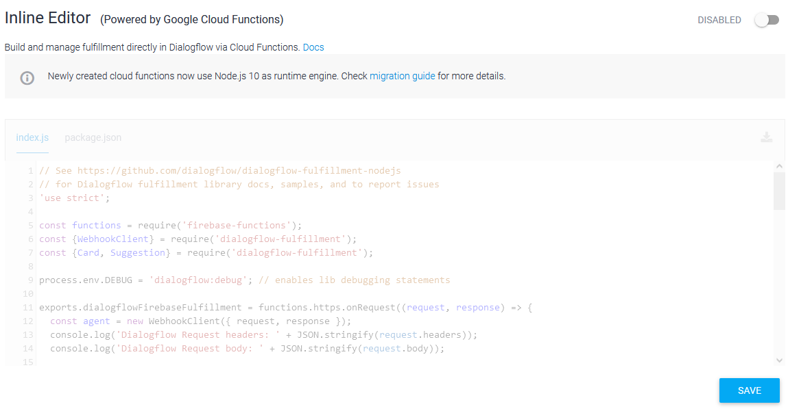 

This allows code execution using ((Google Cloud Service)), though limited to only *Javascript*.

{T}

== Managing Backups 

It is important to make backups regularly when developing a complex chatbot. You can do this by heading to *Settings(Cog Wheel) > Export and Import*

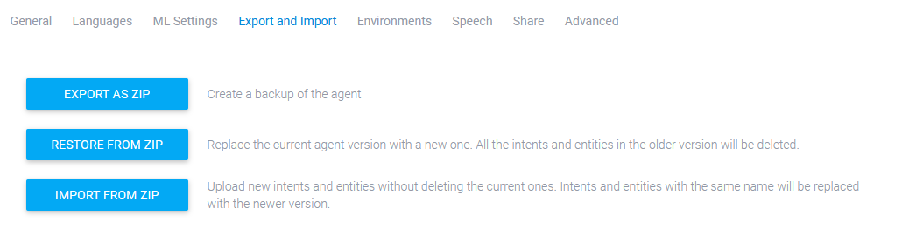 

You can download the agent as a zip file and make a local copy. You can restore or import an agent from another one.

{T}
